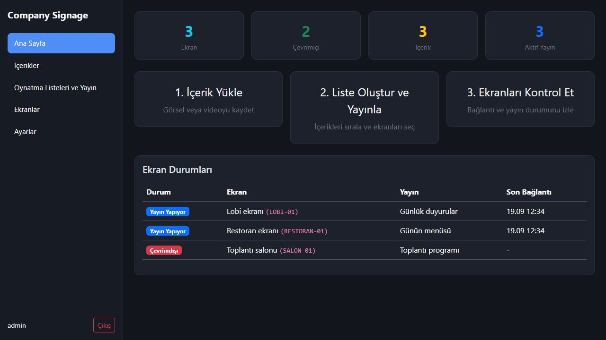
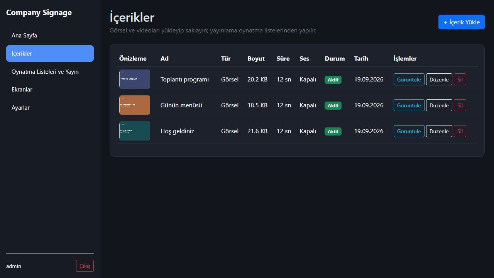

# Company Signage

Birden fazla ekranda görsel ve video yayınlamak için geliştirdiğim bir proje. Lobi, restoran veya toplantı salonundaki ekranlara tek bir panelden içerik gönderebiliyorum. Her ekranın başına gidip dosya değiştirmek yerine, tarayıcıdan bir oynatma listesi hazırlayıp hangi ekranlarda gösterileceğini seçiyorum.



## Nasıl çalışıyor?

Sunucu bir Windows bilgisayarda çalışıyor. Yönetim panelini tarayıcıdan açıyorum; görselleri ve videoları buraya yüklüyorum. Ekrana bağlı bilgisayarda ise **Player** uygulaması var. Bu uygulama kendisine gönderilen içerikleri indirip tam ekran oynatıyor.

Bağlantı kesildiğinde daha önce indirdiği son yayını kullanabiliyor. Henüz indirilmemiş yeni bir içerik için sunucu bağlantısı gerekiyor.

## Neler yapabiliyor?

- Görsel ve video yükleme, tek içerik veya oynatma listesi yayınlama.
- Listedeki içeriklerin sırasını, gösterim süresini ve sesini ayarlama.
- Aynı yayını birden fazla ekrana gönderme.
- Ekranların çevrimiçi olup olmadığını panelden görme.
- Yayını durdurma, oynatıcıyı yenileme ve önbelleği temizleme.
- API üzerinden başlangıç/bitiş tarihi ve öncelik belirleyerek yayın planlama.



*Ekran görüntülerindeki içerikler ve ekranlar örnek olarak hazırlandı.*

## Bilgisayarımda nasıl açarım?

Kaynak kodu çalıştırmak için Windows, **.NET 10 SDK** ve **SQL Server Express** gerekiyor. Player ve yardımcı servis **.NET Framework 4.8** kullanıyor.

```powershell
git clone https://github.com/yusufcinaar/company-signage.git
cd company-signage
dotnet build CompanySignage.sln -c Release
dotnet run --project src/CompanySignage.Web
```

Varsayılan SQL bağlantısı `localhost\SQLEXPRESS`, veritabanı adı `CompanySignagePublic`. SQL kurulumun farklıysa önce `src/CompanySignage.Web/appsettings.json` içindeki bağlantıyı düzenle. Veritabanı ilk açılışta oluşturuluyor; Windows kullanıcının SQL üzerinde buna yetkisi olmalı.

Panel adresi: **http://localhost:5000**. İlk giriş için kullanıcı adı `admin`, örnek şifre `Admin123!`. Kendi kullanımına geçmeden önce **Ayarlar** sayfasından şifreyi değiştir.

Ekran eklerken belirlediğin **ekran kodunu ve cihaz tokenını** Player'a da aynı şekilde girmen gerekiyor. Token, ekranın sunucuya kendini tanıtması için kullanılıyor.

Başka bilgisayarlara kurmak için adımlar: [Kurulum](docs/INSTALLATION.md) · [Player kurulumu](docs/PLAYER_SETUP.md).

## Projede neler var?

- **Web:** Tarayıcıdan kullanılan yönetim paneli; API'yi de aynı adreste çalıştırıyor.
- **Player:** Ekrana bağlı bilgisayarda çalışan WPF uygulaması.
- **Agent.Win7:** Player'ın yanında kurulan yardımcı Windows servisi.
- **Application / Domain / Infrastructure:** Yayın kuralları, veri modelleri ve SQL işlemleri.

C#, ASP.NET Core, Entity Framework Core, SQL Server, WPF ve SignalR kullandım.

## Kontrol ettiğim kısımlar

Bu sürümde 56 sunucu kontrolü ve gerçek Player koduyla yapılan 11 kontrol geçti. Giriş ve cihaz tokenı kontrolü, içerik indirme, oynatma listesi sırası, yayın tarihleri, silme/durdurma ve bozuk önbelleğin yeniden indirilmesi bunların içinde.

Sunucu ve Player paketleri de oluşturuldu. Windows 7 bilgisayarda, gerçek televizyonla ve uzun süreli video oynatmada ayrıca deneme yapmak gerekiyor. Bu sürümde o donanım testlerini yapmadım.

Testi kendi bilgisayarında çalıştırmak için [test notlarına](tests/README.md) bakabilirsin.
